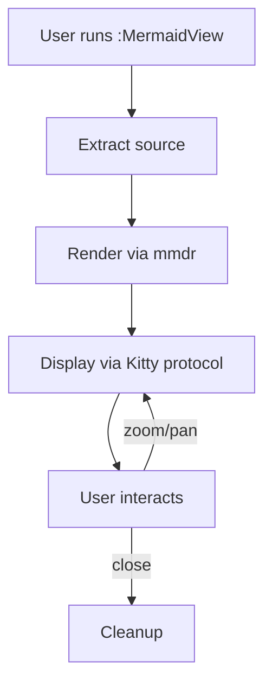
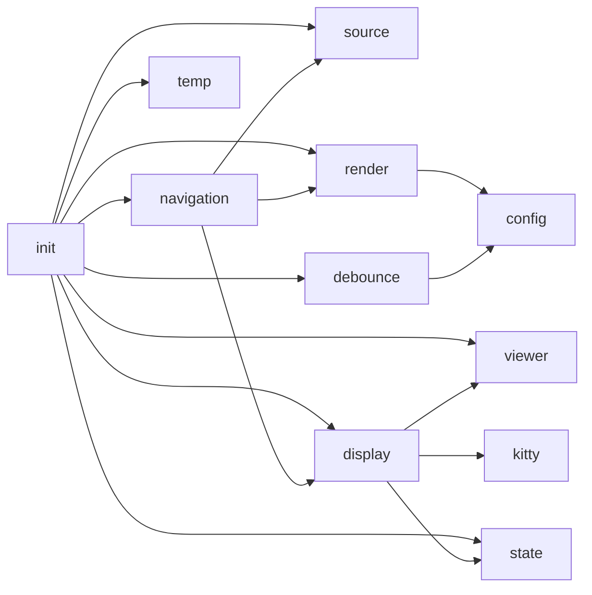
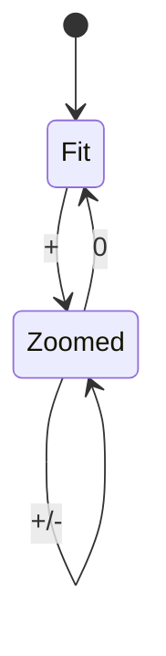

# Architecture Overview

This document describes the mermaid-viewer.nvim architecture.

## Plugin Flow

## Module Dependencies

Some text between diagrams to test cursor detection.

## Zoom State Machine

